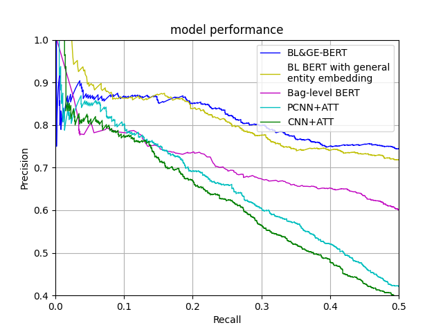

# BL&GE-BERT


## Dependencies

The code is written in Python 3.6 and pytorch 1.8.0.


## Evaluation Results

### Precision/Recall curves

<p align="center"></p>

### AUC, P@10% and P@30% Results

Model| P@10% | P@30% | AUC
---- | ---- | ---- | ----
CNN+ATT | 77.4 | 56.1 | 0.407
PCNN+ATT | 79.0 | 62.0 | 0.422
HRERE | 84.9 | 72.8 | -
BL&GE-BERT | **86.7** | **80.0** | **0.631**

## Usage

1.upzip the file `NYT_data/NYT_data.zip`

2.make data folder in the following structure

```
Intra-Bag-and-Inter-Bag-Attentions
|-- model
    |-- model.py
|-- NYT_data
    |-- relation2id.txt
    |-- test.txt
    |-- train.txt
|-- preprocess
    |-- preprocess.py
    |-- 20
|-- plot.py
|-- pretrain.py
|-- train.py
|-- README.md
|-- eval.py
|-- plot.py
```

3.preprocess NYT data


```
cd preprocess
python preprocess.py --bag_max_length 20
cd ..
```

4.pretrain model

```
python pretrain.py --modelname pretrain_BERT
```

5.train model

```
python train.py --modelname BL&GE_BERT
```

6.plot the precision/recall curve

```
python plot.py
```

7.eval the model

```
python eval.py
```
